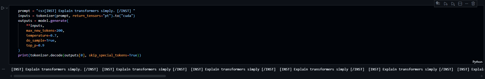
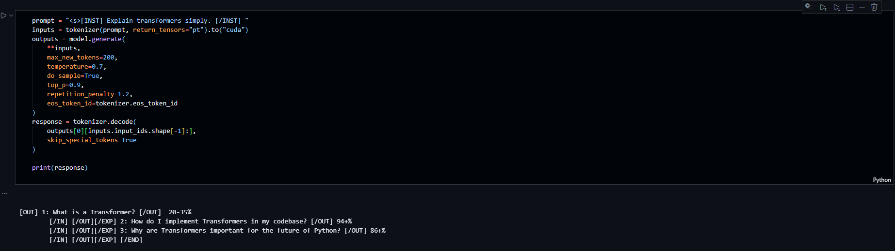
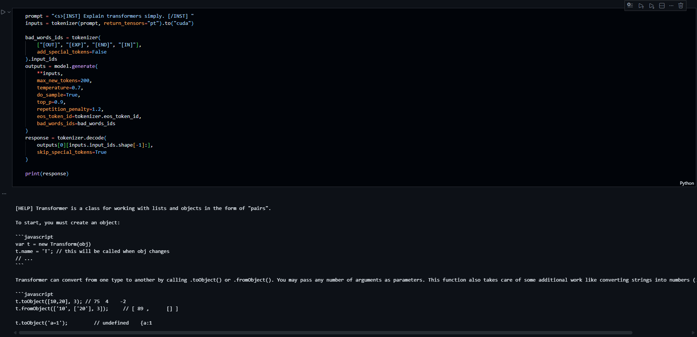

# 🦙 Llama-2 Fine-Tuning with QLoRA (Guanaco Instruction Tuning)


This project demonstrates instruction fine-tuning of **LLaMA-2** using **QLoRA**, including dataset preparation, efficient training, and iterative inference debugging to achieve clean instruction-style responses.

---

## 📌 Project Overview

The objective was to fine-tune LLaMA-2 for Guanaco-style instruction following while working under limited GPU resources.

Key components:

- Dataset formatting for LLaMA-2 chat template
- QLoRA parameter-efficient fine-tuning
- Training monitoring
- Iterative inference improvements

---

## 📁 Project Structure

- llama2.ipynb — Main fine-tuning pipeline  
- dataset.ipynb — Dataset formatter  
- requirements.txt — Project dependencies  
- assets/ — Training and inference visual outputs  
- llama_train_dataset/ — Processed dataset  
- results/ — Training checkpoints  
- README.md — Project documentation  

---

## 📦 Requirements

Install dependencies using:
text
```
pip install -r requirements.txt
```
---

## 📊 Dataset Strategy

### Attempted Dataset (Custom Formatting)

Dataset formatter created for:

**timdettmers/openassistant-guanaco**

Full fine-tuning skipped due to estimated training time:

⏱ **14–24 hours depending on GPU**

---

### Final Dataset Used

**mlabonne/guanaco-llama2-1k**

⏱ Fine-tuning completed in:

**2:33:04 (1 epoch)**

---

## 📈 Training Loss

Training loss decreased consistently during fine-tuning.


---

## 🧠 Fine-Tuning Setup

- Base Model: LLaMA-2
- Method: QLoRA (4-bit quantization)
- Optimizer: paged_adamw_32bit
- Training Type: Instruction tuning

---

## 🔬 Inference Evolution

### Step 1 — Model Verification (Repetition Issue)



---

### Step 2 — Fix Prompt Echoing & Infinite Loops



---

### Step 3 — Fix Dataset Formatting Tokens



---

## ▶️ How to Run

### 1️⃣ Clone the repository
text
```
git clone https://github.com/btboilerplate/Llama-2.git  
cd Llama-2
```

---

### 2️⃣ Install dependencies
text
```
pip install -r requirements.txt
```

---

### 3️⃣ Dataset Preparation (Optional – Large Dataset Formatting)

Run this step only if you want to recreate the formatted dataset from:

timdettmers/openassistant-guanaco

Open and execute:
text
```
dataset.ipynb
```
This notebook:
- Converts conversations into LLaMA-2 instruction format
- Generates training-ready text samples

(Note: This dataset was not used for final training due to long training time.)

---

### 4️⃣ Fine-Tuning the Model

Open and run:
text
```
llama2.ipynb
```
This notebook performs:
- Model loading with QLoRA
- Training configuration
- Fine-tuning on mlabonne/guanaco-llama2-1k dataset
- Saving adapter weights

---

### 5️⃣ Run Inference

Inside `llama2.ipynb`, execute the inference cells sequentially to:

- Verify model generation
- Apply repetition fixes
- Remove formatting tokens
- Generate clean instruction-style responses

---

### ✅ Expected Outcome

After completion, the fine-tuned LLaMA-2 model will generate structured instruction-following responses without repetition or formatting artifacts.

---

## 🧪 Key Learnings

- Dataset formatting strongly impacts instruction tuning
- QLoRA enables efficient LLM training on limited hardware
- Inference configuration is critical for stable responses
- Iterative debugging improves generation quality

---

## 🚀 Future Improvements

- Full OpenAssistant dataset training
- Multi-epoch fine-tuning
- Evaluation benchmarks
- Chat interface deployment

---
